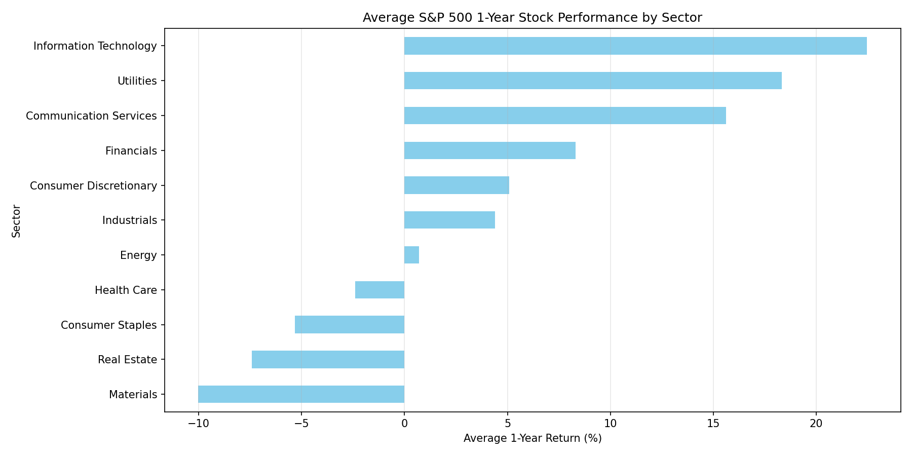
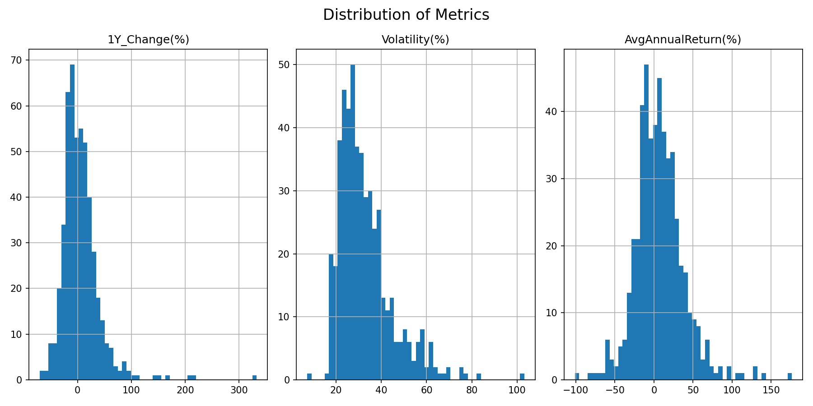
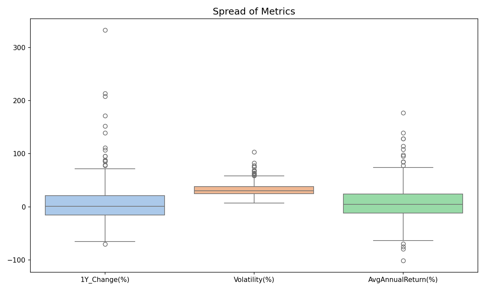
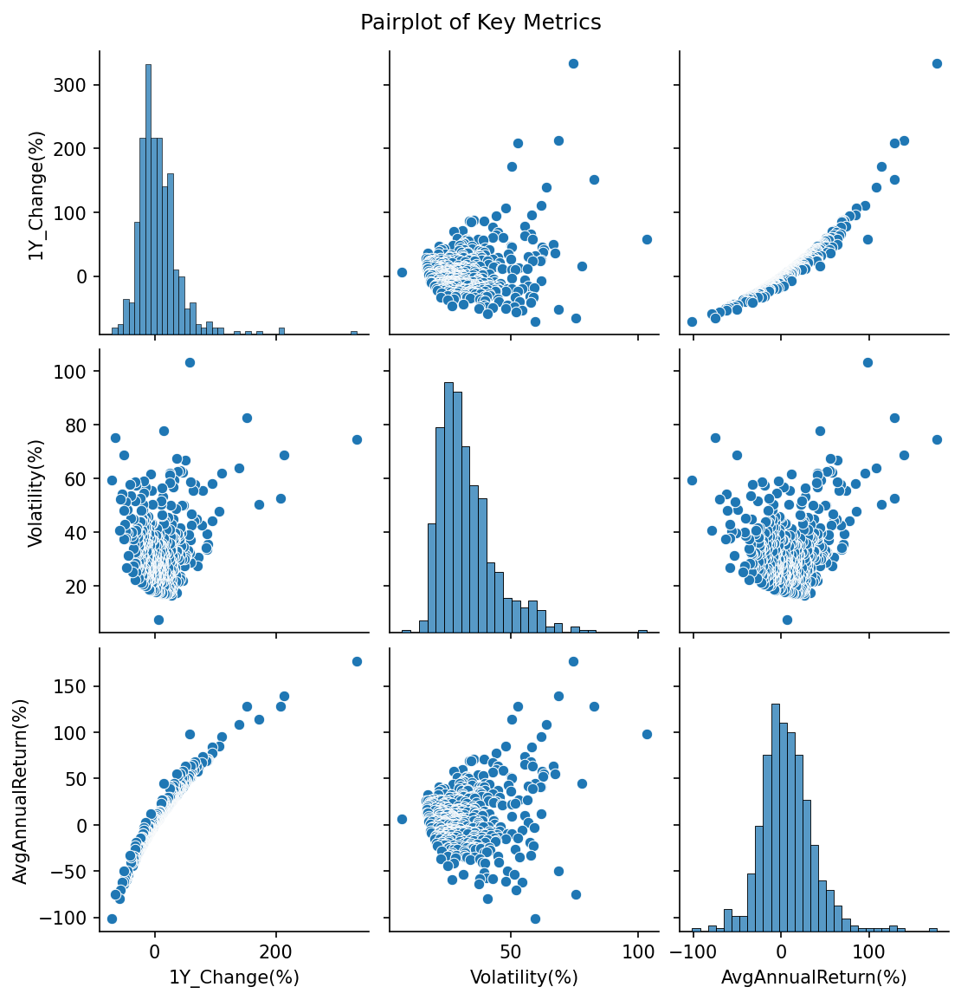

# Data Acquisition: Scraping and Analyzing S&P 500 Stock Performance

**Question:** How have S&P 500 companies performed over the past year and can it help us make future investment decisions?

---

## Why this project
Stock performance reflects both company fundamentals and market sentiment. By analyzing recent trends across the **S&P 500**, we can uncover how different sectors and firms performed, identify high-growth opportunities, and evaluate risk profiles.  
The S&P 500 represents a broad cross-section of the U.S. economy, making it a great dataset for data-driven financial analysis.

---

## Data sources and ethics
I collected a list of S&P 500 constituents from [**Wikipedia**](https://en.wikipedia.org/wiki/List_of_S%26P_500_companies) (public, table-formatted) and used [**Yahoo Finance**](https://finance.yahoo.com/quote/ES%3DF/) via the `yfinance` Python library to pull one-year historical price data.

Both sources are publicly accessible. I followed good scraping practices:
- Used a descriptive `User-Agent` header  
- Limited request frequency  
- Avoided private API keys  
- Checked each site’s `robots.txt` file for compliance  

This ensures that data collection was both ethical and reproducible.

---

## What I built
The final dataset links each S&P 500 ticker to:
- Company name and sector  
- 1-year percent price change  
- Annualized volatility  
- Average annualized return (from daily returns)  
- Maximum drawdown over the year  

**Total sample:** ~500 companies, each with both numeric and categorical variables suitable for exploratory data analysis (EDA) and ranking.

## How others can get started
If you want to build a similar dataset, here’s a quick outline:

1. Use `pandas.read_html()` with `requests.get()` and a custom `User-Agent` to pull the Wikipedia table of S&P 500 companies.  
2. Convert tickers that contain dots (e.g., `BRK.B`) to Yahoo’s format (`BRK-B`).  
3. Use `yfinance.download()` to gather 1-year daily price data for all tickers.  
4. Flatten the resulting multi-index columns (e.g., `AAPL_Close`) or iterate per ticker.  
5. Compute metrics:
   - 1Y change = (last close − first close) / first close  
   - Volatility = std of daily percent changes × sqrt(252)  
   - Average annualized return = mean daily return × 252  
   - Max drawdown = running minimum of (price / cummax(price) − 1)  
6. Merge metrics with sector and company info, then export as CSV.

Full working code is available here: [**Data & Scripts Repository**](https://github.com/mitchster21/Data_Acquisition_Blog_SP500)

---

## Exploratory Data Analysis 

### Top Performers
The top ten performers of the S&P 500 this past year were mostly technology or data-driven firms.  

| **Ticker** | **1Y Change (%)** |
|:------------|------------------:|
| HOOD | 332.83 |
| PLTR | 213.26 |
| WDC  | 208.20 |
| STX  | 171.37 |
| APP  | 152.04 |
| WBD  | 139.27 |
| MU   | 111.03 |
| LRCX | 106.93 |
| AVGO | 95.35 |
| TPR  | 95.17 |
 
High-performing stocks are concentrated in the tech sector, especially companies benefiting from AI and digital platforms. This aligns with broader 2024–2025 market trends emphasizing innovation and software-driven growth.

### Sector Performance

The Information Technology sector led in average annual returns, while Materials, Real Estate, and Consumer Staples lagged. This reflects the market’s focus on tech innovation and growth-oriented investments over traditional industries.

---

### Risk vs Return

There’s a positive relationship between risk and return, so the biggest gainers also had high volatility. This supports the classic “high-risk, high-reward” investment principle.

---

### Distribution of Metrics

- 1-Year percent change and average annual return are roughly normal, while volatility is right-skewed.  
- Correlation plots show strong linear relationships between return-based metrics, while volatility and drawdown share moderate correlation, implying that volatility alone doesn’t explain all downside risk.

---

## Summary Takeaways
- **Tech-led growth:** Technology-oriented sectors dominated year-over-year returns but carried higher volatility.  
- **Concentrated winners:** Gains were driven by a few strong performers rather than a broad market surge.  
- **Hidden variation:** Within each sector, performance dispersion is large and averages can be misleading.  
- **Future investment:** High-growth stocks may offer opportunities but come with elevated risk, requiring careful selection and diversification. We can use these insights to inform portfolio construction and risk management strategies.

## Resources & Links
If you’d like to explore or reproduce this analysis:
- [**S&P 500 List (Wikipedia)**](https://en.wikipedia.org/wiki/List_of_S%26P_500_companies)  
- [**Yahoo Finance / yfinance Documentation**](https://pypi.org/project/yfinance/)  
- [**My Code Repository (Data_Acquisition_Blog_SP500)**](https://github.com/mitchster21/Data_Acquisition_Blog_SP500)

---

## Reproducibility
All code (scraping, cleaning, and EDA) is available in the linked GitHub repository as a Jupyter notebook.  
The notebook exports the final dataset (`sp500_merged.csv`) so readers can recreate the analysis and plots directly.

---

**Author:** *Mitchell Heaton*
